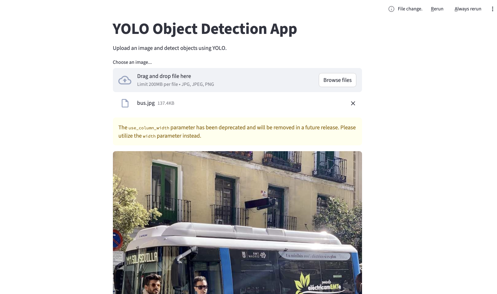
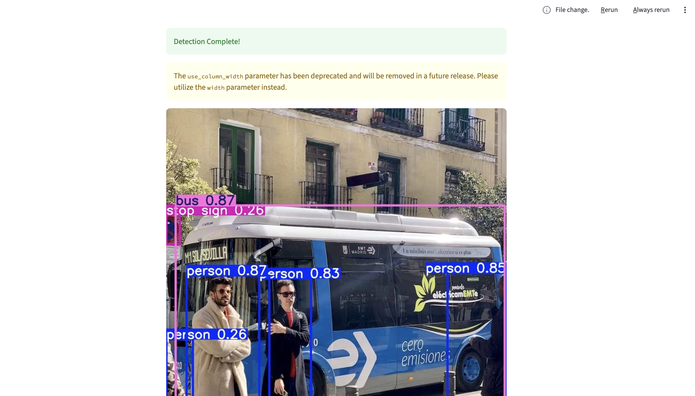

# FastAPI + Streamlit YOLO Object Detection App

## 📌 Project Overview:
This project is a web-based object detection application built using FastAPI, Streamlit, and YOLO (You Only Look Once).

It allows users to upload an image through a Streamlit interface, sends the image to a FastAPI backend endpoint, performs YOLO object detection, and returns the annotated image with detected objects.

---
## 🗂 Features:

- Upload an image via Streamlit UI
- FastAPI backend for high-performance inference
- YOLO-based object detection
- Returns annotated image with bounding boxes
- REST API endpoint (/detect) for detection

---
## 📊 Project Screenshots:




---
## 🏗️ Project Architecture:
```bash
     User 
      │
      ▼
Streamlit Frontend
      │
      ▼
FastAPI Backend (/detect endpoint)
      │
      ▼
YOLO Model Inference
      │
      ▼
Annotated Image Response
```
---
## 🚀 Installation
- 1️⃣ Clone the repository
```bash
git clone https://github.com/Nise-r/fastapi_demo_app
cd fastapi_demo_app
```
- 2️⃣ Install Dependencies
```bash
pip install -r requirements.txt
```
- ▶️ Running the Application
```bash
# Start Fastapi backend: API documentation on http://127.0.0.1:8000/docs
uvicorn main:app --reload

# Start Streamlit Frontend: http://localhost:8501
streamlit run streamlit_app.py
```
  
